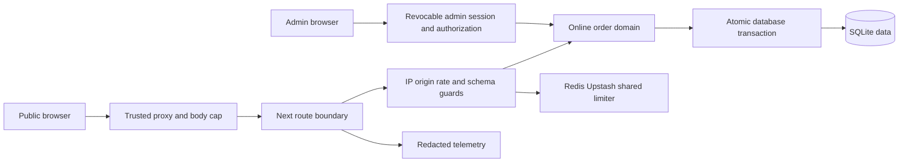

# Online Store Security Hardening Implementation Plan

> **For agentic workers:** Execute tasks in order. Use strict test-driven development: write the listed failing tests, run them to prove the intended failure, implement the smallest complete change, then rerun focused checks. Every task ends with one independent Conventional Commit. Do not combine concerns or defer a failing security test to a later commit.

**Goal:** Resolve every P0, P1 and P2 finding in the Online Store security assessment without changing POS inventory policy or merging the admin and customer trust domains.

**Source:** `docs/security/2026-09-07-online-store-security-assessment.md`

**Builds on:** `docs/superpowers/plans/2026-09-06-online-store.md`

**Architecture:** Public and cookie-authenticated boundaries share small server-only security primitives for bounded body parsing, trusted client IP resolution, Redis/Upstash REST rate limiting, mutation-origin validation and safe telemetry. Online checkout keeps server-authoritative pricing and gains layered anti-abuse before parsing or persistence. Online inventory uses conditional writes inside the order transaction. Customer, guest and admin authorization remain distinct; admin authentication migrates from a stateless HMAC cookie to revocable, identity-bearing database sessions. Public receipt lookup uses an unguessable nonce, while guest order detail remains a separate revocable capability.

**Tech Stack:** Next.js 16 App Router, React 19, TypeScript strict, Prisma 6 with SQLite, Zod 4, Redis/Upstash REST, Vitest 4, Playwright 1.59, Sentry.

## Global constraints

- This plan applies only to Online Store trust boundaries: storefront, checkout, customer auth/order access, guest capabilities, Online Store admin order mutations and their shared security infrastructure. Preserve unrelated POS behavior.
- Prefer Server Components. Add `"use client"` only when browser state or interaction requires it.
- Treat middleware as defense-in-depth, never as the sole authentication or authorization boundary.
- Keep `pos_session` and `customer_session` cryptographically and semantically separate. Never let one authenticate the other.
- Validate every external input with strict Zod schemas and use minimal Prisma selects.
- Never trust client price, product metadata, account id, order status, forwarded IP headers, idempotency result, receipt identifier or capability ownership.
- Preserve the POS negative-stock policy. Conditional stock guards apply only to `channel=online` writes.
- Apply hard byte limits while reading request streams. `Content-Length` is an optional early rejection signal, not the enforcement mechanism.
- Use a server-only Redis/Upstash REST adapter configured through validated environment variables. Production checkout and auth boundaries fail closed with a sanitized `503` if the limiter cannot make an authorization decision; local tests use an explicit injected fake, never an implicit in-memory production fallback.
- Trust a forwarding header only when deployment configuration identifies the immediate proxy and names its authenticated client-IP header. Reject malformed, private or ambiguous external IP values according to the deployment policy; never select arbitrary user-supplied `x-forwarded-for` entries.
- Hash or HMAC rate-limit dimensions before sending keys to Redis. Do not store plaintext phone, token, address, password, cookie or full IP in limiter keys or telemetry.
- Return generic errors. A `429` includes `Retry-After` but does not reveal thresholds, bucket identities or challenge rules.
- Use UTC timestamps and explicit expiry, idle timeout, revocation and retention semantics.
- Never store plaintext session or guest capability tokens. Receipt nonces and opaque tokens require at least 256 bits of cryptographic entropy; persist only digests where replay lookup permits it.
- Sensitive HTML/API responses use `private, no-store`; guest capability responses additionally use `Referrer-Policy: no-referrer` and remain excluded from analytics.
- Logger and Sentry metadata are allowlisted and recursively redacted before serialization. Never pass raw `Request`, headers, Prisma input or unclassified exceptions with attached payloads.
- All schema changes are additive before cutover. Do not edit an applied migration. Generate a new timestamped migration, inspect its SQL and prove it against a copy of legacy data.
- Tests contain synthetic identities only. Never commit live Redis credentials, customer data, tokens, bank details or production log samples.
- Each task gets one concern-specific Conventional Commit. If verification exposes an unrelated defect, fix it in a separate task and commit.
- Do not force-push. Before final delivery, the checked-out branch must be exactly `feat/pos-core`.

## Threat model

### Protected assets

- Inventory correctness, order/payment integrity and operational availability.
- Customer phone, name, address, notes, order history and transaction metadata.
- Customer, guest and admin authentication/capability tokens.
- Admin order-management authority and attributable audit history.
- Security telemetry integrity without retaining unnecessary identifiers.

### Adversaries and capabilities

- Anonymous Internet clients can send concurrent, chunked, malformed and replayed requests, rotate UUIDs, spoof untrusted headers and distribute traffic across IPs/subnets.
- Credential attackers can brute-force one account, spray many phone numbers, target the shared admin password and exploit expensive password verification.
- Cross-site attackers can induce browser requests carrying cookies or omit/mangle browser context headers.
- Curious users can enumerate sequential order codes, share leaked URLs or try cross-account identifiers.
- A token may leak through browser history, referrers, CDN/APM/access logs, analytics or screenshots.
- A compromised admin cookie may be replayed until it expires unless server-side revocation exists.
- Operators or backup readers may access plaintext SQLite data unless infrastructure and retention controls reduce exposure.

### Trust boundaries and invariants

- Rejected body, rate-limit, CSRF and authorization requests perform no business writes.
- One accepted `clientId` creates at most one order, one inventory decrement set, one stock-movement set, one guest access record and one notification.
- Competing online buyers cannot take stock below zero; POS behavior remains unchanged.
- Order ownership is enforced in the database predicate. Public receipt identifiers and guest capabilities are unguessable and have different scopes.
- Every admin mutation authenticates and authorizes at the invoked server boundary.

## Dependency order and release policy

1. Establish a green baseline and explicit configuration contracts.
2. Build shared request/IP/rate-limit primitives before applying route policies.
3. Close P0 checkout integrity and authentication abuse paths before any public rollout.
4. Close P1 authorization, CSRF, idempotency, receipt privacy, telemetry and CSP findings.
5. Complete P2 session, registration, guest lifecycle and privacy/retention work.
6. Run staged rollout and the final release gate. Public launch remains blocked until every P0 and P1 item is complete or has written risk acceptance.

## Assessment traceability

| Finding       | Priority | Primary tasks    | Required outcome                                                            |
| ------------- | -------- | ---------------- | --------------------------------------------------------------------------- |
| `SEC-POS-H01` | P0       | Tasks 4–5        | Hard streamed-body cap plus layered distributed checkout anti-abuse         |
| `SEC-POS-H02` | P0       | Task 6           | Conditional online stock decrement in the business transaction              |
| `SEC-POS-H03` | P0       | Tasks 2–3, 7–8   | Trusted proxy IP and distributed customer/admin auth protection             |
| `SEC-POS-M01` | P2       | Task 16          | Revocable, rotated, identity-bearing admin sessions and audit attribution   |
| `SEC-POS-M02` | P1       | Task 9           | Direct authorization in every Online Store admin read/mutation boundary     |
| `SEC-POS-M03` | P1       | Task 10          | Fail-closed Origin/browser-context policy for cookie mutations              |
| `SEC-POS-M04` | P1       | Task 12          | Cryptographically random receipt lookup; no sequential-code metadata access |
| `SEC-POS-M05` | P1/P2    | Tasks 11, 13, 17 | Recoverable but non-logged guest access with bounded claim/revoke lifecycle |
| `SEC-POS-M06` | P1       | Task 11          | Concurrent idempotent replay and browser-bound guest recovery               |
| `SEC-POS-M07` | P1       | Task 14          | CSP Report-Only observation followed by enforcement                         |
| `SEC-POS-L01` | P2       | Task 15          | Privacy-preserving registration and deterministic race handling             |
| `SEC-POS-L02` | P1       | Task 13          | Central allowlist/redaction across logs, Sentry, analytics and edge logs    |
| `SEC-POS-L03` | P2       | Task 18          | Retention, anonymization, encrypted backup and least-privilege PII access   |
| `SEC-POS-L04` | P2       | Task 15          | Atomic or explicitly consistent registration/session creation               |

---

## Task 1: Baseline security configuration and quality-gate repair

**Priority:** P0 prerequisite
**Depends on:** None

**Files:**

- Modify: `src/config/env.ts`
- Modify: `.env.example`
- Modify: `tests/config/env.test.ts`
- Modify: `package.json` only if a missing focused script is required
- Modify: only existing files required to repair current Prisma generate/typecheck failures; do not include security feature implementation

**Tests first:**

- [ ] Add environment-schema tests proving production rejects absent/malformed Redis REST URL, Redis token, rate-limit key secret, trusted proxy mode/header and public canonical origin.
- [ ] Prove test/development accept explicit safe test values without silently selecting a production in-memory limiter.
- [ ] Run the current `db:generate`, typecheck and focused configuration tests; record the pre-existing failure before repairing it.

**Implementation steps:**

- [ ] Add server-only validated variables for Redis/Upstash REST, keyed pseudonymization secret, trusted proxy/provider mode, authenticated client-IP header, canonical application origin, CSP report-only/enforce mode and retention settings.
- [ ] Put placeholders and deployment explanations in `.env.example`; never include usable credentials.
- [ ] Run Prisma generation and make only compatibility repairs necessary to restore the baseline. Keep those repairs in this commit only when they are inseparable from generated-client/config synchronization; otherwise create a separate prerequisite fix commit before continuing.
- [ ] Document in code comments that production startup must fail before serving traffic when mandatory security configuration is absent.

**Focused quality commands:**

- `pnpm db:generate`
- `pnpm vitest run tests/config/env.test.ts`
- `pnpm typecheck`
- `pnpm exec prettier --check src/config/env.ts tests/config/env.test.ts .env.example package.json`

**Commit:** `chore(security): validate online store security config`

---

## Task 2: Trusted client IP resolution

**Priority:** P0 foundation
**Depends on:** Task 1

**Files:**

- Create: `src/server/http/client-ip.ts`
- Create: `tests/server/http/client-ip.test.ts`
- Modify: `src/server/customer-auth/rate-limit.ts` only to remove/deprecate the unsafe resolver; do not add route limits yet

**Tests first:**

- [ ] Test the configured platform-authenticated IP header, IPv4, IPv6 normalization, IPv4-mapped IPv6, malformed values and missing values.
- [ ] Test spoofed `x-forwarded-for`, multiple conflicting values, private/reserved addresses and direct-origin requests under each configured trust mode.
- [ ] Test that untrusted forwarding headers cannot alter the resulting identity and unresolved production IP returns a typed fail-closed result.

**Implementation steps:**

- [ ] Implement one server-only `resolveTrustedClientIp()` with an explicit result union; do not return the ambiguous string `local`.
- [ ] Normalize valid addresses and derive subnet dimensions without logging raw values.
- [ ] Accept only the configured provider header under the documented trusted-proxy deployment. If self-hosting requires a hop chain, encode the exact trusted-hop count rather than choosing the first value.
- [ ] Remove route usage of the old first-entry `x-forwarded-for` parser in later tasks; retain no production fallback that trusts user input.

**Focused quality commands:**

- `pnpm vitest run tests/server/http/client-ip.test.ts`
- `pnpm lint -- src/server/http/client-ip.ts src/server/customer-auth/rate-limit.ts tests/server/http/client-ip.test.ts`
- `pnpm typecheck`

**Commit:** `feat(security): resolve client ip through trusted proxies`

---

## Task 3: Distributed Redis rate-limit primitive

**Priority:** P0 foundation
**Depends on:** Tasks 1–2

**Files:**

- Add dependency: `package.json`
- Modify lockfile: `pnpm-lock.yaml`
- Create: `src/server/security/rate-limit.ts`
- Create: `src/server/security/rate-limit-policy.ts`
- Create: `tests/server/security/rate-limit.test.ts`

**Tests first:**

- [ ] With an injected fake Redis adapter, test atomic consumption, expiry, remaining quota, retry-after rounding and independent multi-bucket evaluation.
- [ ] Simulate two application instances sharing one store and prove limits cannot be bypassed by alternating instances.
- [ ] Test Redis timeout, transport error and malformed response produce a typed unavailable decision; production-sensitive policy must fail closed.
- [ ] Test HMAC-derived keys never contain plaintext IP, subnet, phone, product id or route input.

**Implementation steps:**

- [ ] Add a server-only Redis/Upstash REST client and an injectable adapter contract; avoid importing it into client bundles.
- [ ] Implement an atomic Lua or provider-supported multi-region-safe limiter. Define versioned key prefixes and TTLs so policy migrations do not collide.
- [ ] Model policies as named bucket sets and return only `allowed`, `retryAfterSeconds` and internal sanitized reason categories.
- [ ] Add bounded timeouts. Never bypass checks after a Redis error on checkout, customer login/register or admin login.
- [ ] Emit aggregate pseudonymous counters for allowed, limited and unavailable outcomes; never emit raw bucket keys.

**Focused quality commands:**

- `pnpm vitest run tests/server/security/rate-limit.test.ts`
- `pnpm lint -- src/server/security/rate-limit.ts src/server/security/rate-limit-policy.ts tests/server/security/rate-limit.test.ts`
- `pnpm typecheck`

**Commit:** `feat(security): add distributed rate limit primitive`

---

## Task 4: Hard request-body byte limit

**Priority:** P0
**Depends on:** Task 1

**Files:**

- Create: `src/server/http/read-json-body.ts`
- Create: `tests/server/http/read-json-body.test.ts`
- Modify: `src/app/api/online/orders/route.ts`
- Modify: deployment configuration/documentation file selected for the actual platform, if tracked
- Modify: `tests/api/online-orders-route.test.ts`

**Tests first:**

- [ ] Test an oversized declared `Content-Length` is rejected before reading.
- [ ] Test chunked/no-`Content-Length` streams crossing 64 KB are cancelled and return `413` before JSON or order logic runs.
- [ ] Test exact-boundary, multibyte UTF-8, malformed JSON, wrong content type and early stream error behavior.
- [ ] Assert rejected requests do not call `createOnlineOrder`, Redis-independent business code or logging with the body.

**Implementation steps:**

- [ ] Implement a reusable stream reader that counts bytes, aborts/cancels on overflow, decodes once and parses JSON after the hard cap succeeds.
- [ ] Require `application/json`; return stable generic `400`, `413` and `415` envelopes with `no-store`.
- [ ] Replace `request.json()` and the current header-only check in checkout.
- [ ] Configure the platform/reverse-proxy request limit at or below the application cap when supported, while retaining the application cap as defense-in-depth.

**Focused quality commands:**

- `pnpm vitest run tests/server/http/read-json-body.test.ts tests/api/online-orders-route.test.ts`
- `pnpm lint -- src/server/http/read-json-body.ts src/app/api/online/orders/route.ts tests/server/http/read-json-body.test.ts tests/api/online-orders-route.test.ts`
- `pnpm typecheck`

**Commit:** `fix(checkout): enforce hard request body limit`

---

## Task 5: Layered checkout anti-abuse policy

**Priority:** P0
**Depends on:** Tasks 2–4

**Files:**

- Create: `src/server/security/checkout-abuse.ts`
- Create: `tests/server/security/checkout-abuse.test.ts`
- Modify: `src/app/api/online/orders/route.ts`
- Modify: `tests/api/online-orders-route.test.ts`
- Modify: `src/types/online-order.ts` only if a challenge response contract is added
- Modify: `instrumentation-client.ts` only to exclude sensitive checkout fields from analytics

**Tests first:**

- [ ] Test burst requests with fresh UUIDs hit IP and subnet buckets and return `429` plus `Retry-After` without order, stock, movement or notification writes.
- [ ] Test post-parse velocity buckets for pseudonymized phone and product ids, and a bounded global emergency bucket.
- [ ] Test limiter unavailability and unresolved trusted IP return generic `503` before expensive/database work.
- [ ] Test legitimate retries with the same `clientId` are evaluated by a retry-safe policy without creating a bypass for rotating UUIDs.
- [ ] Test risk escalation can request Turnstile/CAPTCHA only after policy threshold; challenge verification fails closed and does not affect low-risk traffic.

**Implementation steps:**

- [ ] Apply cheap IP/subnet/global checks after hard body acceptance but before JSON/domain work; apply phone/product velocity after schema normalization and before persistence.
- [ ] Use HMAC-pseudonymized dimensions and versioned policy names. Keep threshold values configurable server-side, not returned to clients.
- [ ] Return sanitized `429`/`503` responses with `Cache-Control: no-store`; add `Retry-After` only when meaningful.
- [ ] Add aggregate alerts for sustained limiter denial, global spikes, repeated product depletion attempts and challenge failures.
- [ ] Define a disabled-by-default adaptive challenge adapter and explicit kill switch; do not require CAPTCHA for all buyers.

**Focused quality commands:**

- `pnpm vitest run tests/server/security/checkout-abuse.test.ts tests/api/online-orders-route.test.ts tests/server/orders/create-online-order.test.ts`
- `pnpm lint -- src/server/security/checkout-abuse.ts src/app/api/online/orders/route.ts tests/server/security/checkout-abuse.test.ts tests/api/online-orders-route.test.ts`
- `pnpm typecheck`

**Commit:** `feat(checkout): add distributed anti abuse controls`

---

## Task 6: Atomic online stock decrement

**Priority:** P0
**Depends on:** Task 4; can proceed in parallel with Task 5 after shared prerequisites

**Files:**

- Modify: `src/server/orders/create-order.ts`
- Modify: `src/server/orders/create-online-order.ts`
- Modify: `tests/server/orders/create-order.test.ts`
- Modify: `tests/server/orders/create-online-order.test.ts`
- Create: `tests/server/orders/online-stock-concurrency.test.ts`

**Tests first:**

- [ ] Add a real-database concurrency test where two different checkout requests compete for the final stock; exactly one succeeds and one returns `OUT_OF_STOCK`.
- [ ] Assert final stock is zero, never negative, and only the winner has one order, one movement set and one notification.
- [ ] Test a multi-line order rolls back all order/payment/item/movement/notification writes when any conditional decrement affects zero rows.
- [ ] Lock POS regression tests proving POS can still sell into negative stock and retains `hasStockWarning` behavior.

**Implementation steps:**

- [ ] Move the online stock invariant into the transaction that creates the order and related writes.
- [ ] For each normalized online line, execute a conditional update with product eligibility and `stock >= requestedQuantity`; require exactly one affected row.
- [ ] Throw a typed transaction error on any failed guard, rollback all lines, then map it to stable `OUT_OF_STOCK` without leaking current inventory.
- [ ] Keep unconditional decrement for POS behind an explicit channel-specific branch. Do not globally change `createOrder` semantics.
- [ ] Confirm SQLite transaction/locking behavior in tests and document the equivalent predicate needed before any future database-provider migration.

**Focused quality commands:**

- `pnpm vitest run tests/server/orders/online-stock-concurrency.test.ts tests/server/orders/create-online-order.test.ts tests/server/orders/create-order.test.ts tests/server/orders/cancel-order.test.ts`
- `pnpm typecheck`
- `pnpm lint -- src/server/orders/create-order.ts src/server/orders/create-online-order.ts tests/server/orders/online-stock-concurrency.test.ts`

**Commit:** `fix(inventory): make online stock decrement atomic`

---

## Task 7: Distributed customer authentication protection

**Priority:** P0
**Depends on:** Tasks 2–3

**Files:**

- Replace or modify: `src/server/customer-auth/rate-limit.ts`
- Modify: `src/app/api/customer-auth/login/route.ts`
- Modify: `src/app/api/customer-auth/register/route.ts`
- Modify: `tests/server/customer-auth/rate-limit.test.ts`
- Modify/create focused customer-auth API tests under `tests/api/`

**Tests first:**

- [ ] Test one IP spraying many phones, many IPs targeting one phone, subnet velocity and a bounded global bucket across shared limiter instances.
- [ ] Test spoofed forwarding headers cannot rotate identities and Redis failure returns `503` before password hashing/verification.
- [ ] Test success and failure counters are pseudonymized, credentials stay generic, and `429` includes `Retry-After`.
- [ ] Test successful login resets/relaxes only the appropriate account bucket without erasing IP/global abuse history.

**Implementation steps:**

- [ ] Replace the process-local `Map` with named distributed policies combining trusted IP, subnet, normalized phone/account pseudonym and global velocity.
- [ ] Perform cheap IP limits before expensive password work and account-specific checks after safe normalization.
- [ ] Add bounded response jitter/backoff without holding scarce resources; keep response semantics close enough to avoid account discovery.
- [ ] Emit alerts for credential stuffing and spraying using pseudonymous dimensions and aggregate counts.

**Focused quality commands:**

- `pnpm vitest run tests/server/customer-auth/rate-limit.test.ts tests/server/customer-auth/password.test.ts tests/api/customer-auth-login-route.test.ts tests/api/customer-auth-register-route.test.ts`
- `pnpm lint -- src/server/customer-auth/rate-limit.ts src/app/api/customer-auth/login/route.ts src/app/api/customer-auth/register/route.ts`
- `pnpm typecheck`

**Commit:** `fix(customer-auth): enforce distributed login limits`

---

## Task 8: Admin login abuse protection

**Priority:** P0
**Depends on:** Tasks 2–3

**Files:**

- Create: `src/server/auth/rate-limit.ts`
- Modify: `src/app/api/auth/login/route.ts`
- Create: `tests/server/auth/rate-limit.test.ts`
- Create: `tests/api/admin-login-route.test.ts`

**Tests first:**

- [ ] Test repeated failures across instances hit IP/subnet/global admin-login buckets before expensive password verification.
- [ ] Test successful and failed attempts receive bounded backoff, generic errors and no password/raw IP logging.
- [ ] Test spoofed IP headers, missing trusted IP and Redis outage fail closed.
- [ ] Test a successful login rotates/replaces any presented admin session cookie and emits a pseudonymous security event.

**Implementation steps:**

- [ ] Add a stricter admin-login policy distinct from customer limits; do not share counters between auth domains.
- [ ] Apply the trusted-IP resolver and distributed limiter before `verifyPassword()`.
- [ ] Add alert thresholds for brute force/global failures without returning policy details.
- [ ] Keep this commit compatible with the current stateless admin cookie; Task 16 replaces session persistence independently.

**Focused quality commands:**

- `pnpm vitest run tests/server/auth/rate-limit.test.ts tests/api/admin-login-route.test.ts tests/server/auth/session.test.ts`
- `pnpm lint -- src/server/auth/rate-limit.ts src/app/api/auth/login/route.ts tests/server/auth/rate-limit.test.ts tests/api/admin-login-route.test.ts`
- `pnpm typecheck`

**Commit:** `fix(admin-auth): protect admin login from brute force`

---

## Task 9: Route-level and Server Action admin authorization

**Priority:** P1
**Depends on:** Task 8

**Files:**

- Modify: `src/server/auth/require-admin-session.ts`
- Modify: `src/app/admin/orders/actions.ts`
- Modify: admin Online Store pages/components that read sensitive order data
- Create: `tests/server/auth/admin-order-authorization.test.ts`
- Modify/create action tests under `tests/server/orders/`
- Modify: `e2e/online-store.spec.ts`

**Tests first:**

- [ ] Invoke every Online Store admin Server Action directly with no cookie, customer cookie, invalid admin cookie and valid admin cookie.
- [ ] Assert anonymous/customer callers cannot cancel, transition or mark orders paid and cause no writes/revalidation.
- [ ] Test sensitive admin Server Components and route handlers call authorization at their own data boundary even if middleware is bypassed in the test.
- [ ] Add a source-level inventory test listing exported admin mutation actions so a new unaudited action fails the suite.

**Implementation steps:**

- [ ] Make `requireAdminSession()` usable consistently in Server Components, Server Actions and route handlers with typed unauthorized behavior.
- [ ] Call it as the first operation in each Online Store admin mutation, before parsing identifiers or loading data.
- [ ] Validate action arguments with strict schemas after authentication; retain domain-level channel and transition authorization.
- [ ] Keep middleware protection but document it as the outer layer only.

**Focused quality commands:**

- `pnpm vitest run tests/server/auth/admin-order-authorization.test.ts tests/server/orders/update-online-order.test.ts tests/server/orders/cancel-order.test.ts`
- `pnpm test:e2e -- e2e/online-store.spec.ts --grep "admin authorization"`
- `pnpm typecheck`

**Commit:** `fix(admin): authorize online order server actions`

---

## Task 10: Fail-closed Origin and CSRF validation

**Priority:** P1
**Depends on:** Task 1; implement after Task 9 so all mutation boundaries are inventoried

**Files:**

- Modify: `src/server/http/origin.ts`
- Create: `tests/server/http/origin.test.ts`
- Modify: cookie-authenticated mutation routes under `src/app/api/customer-auth/`, `src/app/api/customer/orders/` and `src/app/api/admin/`
- Modify: `src/app/admin/orders/actions.ts` if an explicit Server Action wrapper/check is required
- Modify focused API/action tests

**Tests first:**

- [ ] Test same-origin canonical production Origin succeeds; cross-site, missing, malformed, opaque/null and mismatched scheme/host/port fail.
- [ ] Test `Sec-Fetch-Site: cross-site` always fails and same-origin/same-site handling matches the explicit policy.
- [ ] Test non-browser exceptions, if any, require a route-specific CSRF token or separate non-cookie authentication; missing Origin alone must never silently pass a cookie mutation in production.
- [ ] Exercise logout, notification read, order mutation and guest claim/revoke boundaries with failing requests causing no writes.

**Implementation steps:**

- [ ] Replace request-URL comparison with canonical configured origins and a fail-closed result carrying only safe reason codes.
- [ ] Apply one helper consistently to all cookie-authenticated Online Store mutations, including route handlers and action entry points not already protected by framework-origin enforcement.
- [ ] Keep `SameSite`, secure cookies and framework Server Action allowed-origins configuration as additional layers.
- [ ] Return generic `403` and `no-store`; never echo attacker-controlled Origin.

**Focused quality commands:**

- `pnpm vitest run tests/server/http/origin.test.ts tests/api/admin-notifications-route.test.ts tests/api/customer-auth-logout-route.test.ts`
- `pnpm lint -- src/server/http/origin.ts src/app/api/customer-auth src/app/api/customer src/app/api/admin`
- `pnpm typecheck`

**Commit:** `fix(security): fail closed on unsafe mutation origins`

---

## Task 11: Concurrent idempotency and guest capability recovery

**Priority:** P1
**Depends on:** Task 6

**Files:**

- Modify: `prisma/schema.prisma`
- Create: `prisma/migrations/<timestamp>_online_checkout_idempotency/migration.sql`
- Modify: `src/server/orders/create-online-order.ts`
- Modify: `src/server/orders/create-order.ts`
- Modify: `src/app/api/online/orders/route.ts`
- Modify: checkout client code under `src/features/online-store/`
- Modify/create: `tests/server/orders/online-order-idempotency.test.ts`
- Modify: `tests/api/online-orders-route.test.ts`
- Modify: `e2e/online-store.spec.ts`

**Tests first:**

- [ ] Launch two requests with the same `clientId`; assert both return a consistent successful logical result and only one order/inventory movement/notification exists.
- [ ] Force a unique conflict after the pre-read and prove it is caught and replayed rather than returned as `500`.
- [ ] Simulate loss of the first guest response and prove retry in the same browser recovers access without storing plaintext capability in the database or minting a second unrestricted capability.
- [ ] Test another browser with only the `clientId` cannot recover guest access, and expired/consumed recovery state fails.

**Implementation steps:**

- [ ] Add a purpose-built idempotency/recovery record containing request fingerprint, status, order relation, expiry and a digest bound to a short-lived `HttpOnly`, `Secure`, `SameSite=Lax` pending-checkout cookie.
- [ ] Canonicalize and hash security-relevant request fields. Reusing a `clientId` with a different fingerprint returns a conflict, never the original order.
- [ ] Resolve concurrent unique conflicts inside/around the transaction by reading the committed record and replaying the allowlisted response.
- [ ] Bind guest capability recovery to the pending cookie through a one-time exchange or deterministic encrypted response material; do not persist capability plaintext or expose recovery by `clientId` alone.
- [ ] Expire/delete pending recovery state after exchange or bounded TTL while preserving durable order idempotency.

**Focused quality commands:**

- `pnpm db:generate`
- `pnpm vitest run tests/server/orders/online-order-idempotency.test.ts tests/server/orders/online-stock-concurrency.test.ts tests/api/online-orders-route.test.ts`
- `pnpm test:e2e -- e2e/online-store.spec.ts --grep "idempotency|lost response|guest recovery"`
- `pnpm typecheck`

**Commit:** `fix(checkout): replay concurrent idempotent results`

---

## Task 12: Non-enumerable public receipt lookup

**Priority:** P1
**Depends on:** Task 11

**Files:**

- Modify: `prisma/schema.prisma`
- Create: `prisma/migrations/<timestamp>_public_receipt_nonce/migration.sql`
- Modify: `src/server/orders/create-order.ts`
- Modify: `src/app/api/online/orders/route.ts`
- Modify: `src/app/order-success/[code]/page.tsx` or replace with `src/app/order-success/[receipt]/page.tsx`
- Modify checkout navigation under `src/features/online-store/`
- Create: `tests/server/orders/public-receipt.test.ts`
- Modify: `tests/api/online-orders-route.test.ts`
- Modify: `e2e/online-store.spec.ts`

**Tests first:**

- [ ] Prove sequential codes such as `DH0001` cannot retrieve transaction metadata anonymously.
- [ ] Test a 256-bit receipt nonce opens only the minimal receipt, while malformed/random/expired values return indistinguishable not-found behavior.
- [ ] Test receipt responses contain no PII/items/capability and use `private, no-store`, `noindex` and a restrictive referrer policy.
- [ ] Add a bounded rate-limit/enumeration test for receipt misses without allowing it to become the only access control.

**Implementation steps:**

- [ ] Create an unguessable receipt identifier/digest separate from the display order code and guest detail capability.
- [ ] Generate it atomically with the online order and return only the public receipt URL needed by the browser.
- [ ] Stop database lookup by sequential code on the public route; retain the display code only after a valid nonce lookup.
- [ ] Apply a lightweight distributed lookup policy and generic not-found rendering.
- [ ] Decide migration behavior for existing online orders: default to no anonymous metadata until a nonce is explicitly backfilled; never derive nonce from order code.

**Focused quality commands:**

- `pnpm db:generate`
- `pnpm vitest run tests/server/orders/public-receipt.test.ts tests/api/online-orders-route.test.ts`
- `pnpm test:e2e -- e2e/online-store.spec.ts --grep "receipt|enumeration"`
- `pnpm typecheck`

**Commit:** `fix(receipts): replace sequential public lookup`

---

## Task 13: Central token and PII telemetry redaction

**Priority:** P1
**Depends on:** Tasks 5, 11–12 so all sensitive identifiers are known

**Files:**

- Modify: `src/lib/logger.ts`
- Create: `src/lib/log-redaction.ts`
- Modify: `sentry.server.config.ts`
- Modify: `sentry.edge.config.ts`
- Modify: `instrumentation-client.ts`
- Create: `tests/lib/log-redaction.test.ts`
- Create: `tests/config/sentry-redaction.test.ts`
- Modify logging call sites in Online Store scope only

**Tests first:**

- [ ] Feed nested objects, arrays, errors and URL strings containing cookies, authorization, passwords, phone/address, guest token, receipt nonce and query values; assert output is removed, masked or replaced.
- [ ] Test circular structures and hostile getters cannot crash the logger or leak values.
- [ ] Test Sentry `beforeSend` redacts request headers, cookies, URL path/query, breadcrumbs, exception extras and user fields.
- [ ] Test analytics never receives checkout form values, guest/receipt URLs or customer identifiers.

**Implementation steps:**

- [ ] Replace arbitrary logger metadata with event-specific allowlisted schemas and recursive defense-in-depth redaction.
- [ ] Normalize guest and receipt paths to route templates before access/APM logging; coordinate equivalent CDN/reverse-proxy redaction outside application code.
- [ ] Configure Sentry hooks for server, edge and client. Disable body capture and sensitive default integrations where necessary.
- [ ] Add log retention/access variables and an operational verification checklist; avoid logging limiter HMAC keys even though they are pseudonymous.
- [ ] Sweep Online Store logging call sites and replace raw exceptions/requests with safe error class, code and correlation id.

**Focused quality commands:**

- `pnpm vitest run tests/lib/log-redaction.test.ts tests/config/sentry-redaction.test.ts tests/api/online-orders-route.test.ts`
- `pnpm lint -- src/lib/logger.ts src/lib/log-redaction.ts sentry.server.config.ts sentry.edge.config.ts instrumentation-client.ts`
- `pnpm typecheck`

**Commit:** `fix(observability): redact online store secrets and pii`

---

## Task 14: Content Security Policy rollout

**Priority:** P1
**Depends on:** Task 13 so violation reporting is safe

**Files:**

- Modify: `next.config.ts`
- Modify: `src/middleware.ts` or root layout if request nonces are required
- Create: `src/server/security/csp.ts`
- Create: `tests/config/csp.test.ts`
- Modify: `e2e/online-store.spec.ts`

**Tests first:**

- [ ] Parse generated policy and assert `default-src`, `script-src`, `style-src`, `img-src`, `connect-src`, `frame-ancestors`, `base-uri`, `form-action` and `object-src` are present and restrictive.
- [ ] Assert no broad `*`, unsafe object/frame source or accidental production `unsafe-eval`; nonce/hash handling must match actual Next.js rendering.
- [ ] Test only required Sentry, Vercel and image origins are allowlisted per environment.
- [ ] Add browser coverage that captures CSP violations on storefront, checkout, customer account, guest order and admin order pages.

**Implementation steps:**

- [ ] Build a deterministic environment-aware CSP generator and a safe report endpoint/provider configuration that does not collect query/path tokens.
- [ ] Deploy `Content-Security-Policy-Report-Only` first; collect and classify only sanitized violations.
- [ ] Remove legitimate violations by adding the narrowest host/hash/nonce, not broad unsafe directives.
- [ ] Promote the same policy to enforcement through an environment flag after the report-only acceptance window; retain an immediate switch back to report-only.
- [ ] Keep existing HSTS, MIME, frame, referrer and permissions headers.

**Focused quality commands:**

- `pnpm vitest run tests/config/csp.test.ts tests/config/env.test.ts`
- `pnpm test:e2e -- e2e/online-store.spec.ts --grep "CSP"`
- `pnpm build`

**Commit:** `feat(security): add enforceable content security policy`

---

## Task 15: Atomic registration and phone-enumeration policy

**Priority:** P2
**Depends on:** Tasks 7 and 10

**Files:**

- Modify: `src/app/api/customer-auth/register/route.ts`
- Modify: `src/server/customer-auth/session.ts`
- Create/modify: `tests/server/customer-auth/register.test.ts`
- Modify: focused registration route/component tests
- Modify customer auth UI only for generic recovery/login guidance

**Tests first:**

- [ ] Run concurrent registration with one normalized phone; assert no `500`, no duplicate account and deterministic privacy-preserving responses.
- [ ] Force session creation failure and assert the chosen account/session transaction or retry policy leaves a documented consistent state.
- [ ] Compare existing-phone and new-phone observable status/body/timing class and ensure rate limiting applies equally.
- [ ] Test no response or telemetry reveals phone/account existence.

**Implementation steps:**

- [ ] Adopt the privacy-first policy: externally equivalent accepted response for existing and new normalized phones, with generic login/recovery guidance.
- [ ] Catch Prisma unique conflicts as the expected concurrent outcome; never serialize the database error.
- [ ] Make account plus initial session creation atomic, or explicitly persist an account without claiming login success and support safe retry.
- [ ] Add bounded timing equalization compatible with rate limits; do not emulate expensive hashing without a reviewed constant dummy hash.

**Focused quality commands:**

- `pnpm vitest run tests/server/customer-auth/register.test.ts tests/server/customer-auth/password.test.ts tests/api/customer-auth-register-route.test.ts`
- `pnpm typecheck`
- `pnpm lint -- src/app/api/customer-auth/register/route.ts src/server/customer-auth/session.ts`

**Commit:** `fix(customer-auth): prevent registration enumeration races`

---

## Task 16: Revocable identity-bearing admin sessions

**Priority:** P2
**Depends on:** Tasks 8–10

**Files:**

- Modify: `prisma/schema.prisma`
- Create: `prisma/migrations/<timestamp>_revocable_admin_sessions/migration.sql`
- Replace/modify: `src/server/auth/session.ts`
- Modify: `src/server/auth/require-admin-session.ts`
- Modify: `src/app/api/auth/login/route.ts`
- Create: `src/app/api/auth/logout/route.ts`
- Create admin session-management route/UI only if included in the accepted product scope
- Modify: `tests/server/auth/session.test.ts`
- Modify: `tests/api/admin-login-route.test.ts`
- Create: `tests/api/admin-logout-route.test.ts`
- Modify: `e2e/online-store.spec.ts`

**Tests first:**

- [ ] Test only token digests are stored; valid, expired, idle-expired, revoked and disabled-principal sessions resolve correctly.
- [ ] Test login rotates/fixes sessions, logout revokes server-side state, and one session can be revoked without changing a global secret.
- [ ] Test session records carry principal identity/role and admin order audit records attribute mutations.
- [ ] Test the legacy HMAC cookie is rejected after cutover and customer cookies remain unusable in admin boundaries.

**Implementation steps:**

- [ ] Add `AdminIdentity`, role/version/disabled state, `AdminSession` with opaque digest, absolute expiry, idle expiry, last-seen and revoke metadata, plus an admin action audit model if no suitable audit model exists.
- [ ] Seed/migrate one initial owner identity from deployment-controlled credentials without storing plaintext passwords or exposing it in migration SQL.
- [ ] Replace 30-day stateless HMAC verification with DB-backed resolution, shorter absolute lifetime, bounded idle timeout and throttled last-seen writes.
- [ ] Rotate the opaque token after authentication; revoke on logout, password/role/version change and incident response.
- [ ] Make all Online Store admin mutations write minimal attributable audit events without customer PII snapshots.
- [ ] Provide a documented emergency procedure to revoke all sessions and rotate relevant secrets.

**Focused quality commands:**

- `pnpm db:generate`
- `pnpm vitest run tests/server/auth/session.test.ts tests/api/admin-login-route.test.ts tests/api/admin-logout-route.test.ts tests/server/auth/admin-order-authorization.test.ts`
- `pnpm test:e2e -- e2e/online-store.spec.ts --grep "admin session|logout|revocation"`
- `pnpm typecheck`

**Commit:** `feat(admin-auth): add revocable admin sessions`

---

## Task 17: Guest capability claim and revocation lifecycle

**Priority:** P2
**Depends on:** Tasks 10–11 and verified customer identity policy

**Files:**

- Modify: `src/server/orders/order-access.ts`
- Create or modify: `src/app/api/customer/orders/claim/route.ts`
- Create: `src/app/api/customer/orders/guest-access/revoke/route.ts`
- Modify: `src/app/orders/guest/[token]/page.tsx`
- Modify account order UI under `src/app/account/orders/`
- Create/modify focused tests under `tests/server/orders/` and `tests/api/`
- Modify: `e2e/online-store.spec.ts`

**Tests first:**

- [ ] Test wrong, expired, revoked and already-claimed capabilities fail with indistinguishable responses.
- [ ] Test claim requires an authenticated, verified account satisfying the approved ownership proof; matching an unverified phone string is insufficient.
- [ ] Test claim atomically assigns an unowned order and revokes guest access; concurrent claim attempts have exactly one valid outcome.
- [ ] Test the owner can explicitly revoke remaining guest access and the old URL immediately stops working.

**Implementation steps:**

- [ ] Finalize ownership proof, preferring verified phone/OTP established outside the capability itself.
- [ ] Implement claim as one transaction with current ownership, expiry and revoke predicates.
- [ ] Revoke capability after successful claim and expose an authenticated revoke action for owned orders.
- [ ] Shorten default guest capability lifetime from 30 days to the approved bounded value; preserve no-store/no-referrer/noindex behavior.
- [ ] Add cleanup for expired capability and pending-recovery records without deleting orders.

**Focused quality commands:**

- `pnpm vitest run tests/server/orders/order-access.test.ts tests/api/customer-order-claim-route.test.ts tests/api/guest-access-revoke-route.test.ts`
- `pnpm test:e2e -- e2e/online-store.spec.ts --grep "guest claim|guest revoke"`
- `pnpm typecheck`

**Commit:** `feat(customer-orders): add guest access lifecycle controls`

---

## Task 18: Privacy retention, backup and PII access controls

**Priority:** P2
**Depends on:** Tasks 13, 16–17

**Files:**

- Create: `docs/security/online-store-data-retention.md`
- Create: `src/server/privacy/retention.ts`
- Create: `scripts/apply-online-store-retention.ts`
- Create: `tests/server/privacy/retention.test.ts`
- Modify: `prisma/schema.prisma` only if tombstone/legal-hold fields are necessary
- Create a new migration only if the schema changes
- Modify deployment/runbook documentation for encrypted volume/backups and service-account permissions

**Tests first:**

- [ ] Test the data inventory classifies contact/order/session/capability/idempotency/audit/log fields with owner, purpose and retention.
- [ ] Test dry-run selection at exact retention boundaries, legal hold/exemptions, idempotent deletion/anonymization and preservation of financial/inventory invariants.
- [ ] Test expired sessions, capabilities, pending recovery and rate-limit/telemetry identifiers are purged independently of retained order records.
- [ ] Test customer PII anonymization does not break aggregate totals, stock movements, notification integrity or required audit attribution.

**Implementation steps:**

- [ ] Record approved retention periods, legal/accounting basis, data-subject deletion/anonymization behavior, log/APM retention and access roles.
- [ ] Implement a dry-run-by-default retention service and script with bounded batches, checkpoints, audit summary and explicit destructive confirmation.
- [ ] Prefer anonymization of retained financial orders; delete transient tokens/sessions/idempotency records at shorter TTLs.
- [ ] Document full-disk/volume and backup encryption, key ownership/rotation, least-privilege file/service accounts, backup restore tests and access audits.
- [ ] Verify SQLite/database files and backups are excluded from source artifacts and are never copied into CI artifacts.
- [ ] Decide field-level encryption only if the accepted threat model requires infrastructure administrators not to read PII; do not add ad hoc encryption without key-management design.

**Focused quality commands:**

- `pnpm vitest run tests/server/privacy/retention.test.ts tests/server/orders/order-access.test.ts tests/server/orders/create-online-order.test.ts`
- `pnpm exec tsx scripts/apply-online-store-retention.ts --dry-run`
- `pnpm typecheck`
- `pnpm exec prettier --check docs/security/online-store-data-retention.md src/server/privacy/retention.ts scripts/apply-online-store-retention.ts tests/server/privacy/retention.test.ts`

**Commit:** `feat(privacy): enforce online store data retention`

---

## Migration considerations

- Create separate additive migrations for checkout idempotency/recovery, public receipt nonce, revocable admin sessions and any retention metadata. Each migration belongs to its feature commit.
- Run `pnpm db:generate` after every schema change and commit generated lock/config changes only when tracked by repository policy.
- Test every migration against a copied database containing legacy POS products, negative-stock orders, online orders with guest access, customer sessions and admin notifications.
- For new required semantics, use nullable/additive columns first, backfill in bounded batches, verify counts/digests/uniqueness, then enforce constraints in a later migration if SQLite table rebuild is required.
- Never synthesize public receipt nonces from sequential order codes. Existing receipts should become private/not-found until assigned cryptographically random values.
- Introduce admin identity/session tables before rejecting legacy cookies. Seed the initial principal through a controlled deployment step; then deploy cutover and invalidate all stateless cookies.
- Account for SQLite write serialization in concurrency tests. Set an explicit transaction timeout/retry policy and ensure retries preserve idempotency; do not interpret lock errors as stock success.
- Redis key schema is versioned and ephemeral. No database migration depends on Redis contents; rollback may abandon old prefixes until TTL expiration.
- Before deployment, snapshot and encrypt the database; verify restore in an isolated environment. A rollback must restore application and schema-compatible data without replaying orders or stock changes.

## Rollout and rollback

### Stage 0: Dark validation

- Deploy environment validation, trusted-IP resolution and Redis connectivity with synthetic checks before routing public traffic.
- Confirm the platform overwrites the configured client-IP header and blocks direct origin access. Test spoofed forwarding headers from the public edge.
- Enable shadow metrics for proposed rate policies without storing raw dimensions. Compare false-positive risk using synthetic/test accounts only.

### Stage 1: P0 enforcement

- Enable hard body cap, checkout/auth fail-closed Redis limits and atomic online stock writes.
- Start with reviewed conservative thresholds and alert on denial/unavailable rates. Keep a server-side policy configuration rollback, but never roll back to bypass-on-error for public checkout/auth.
- Run a controlled final-stock concurrency canary and verify one winner, one domain conflict and consistent movements/notifications.
- Rollback: disable public checkout/login at the gateway if Redis/trusted-IP enforcement is unhealthy; do not reopen unprotected endpoints. Revert application only to the last schema-compatible release.

### Stage 2: P1 controls

- Deploy direct admin authorization and fail-closed Origin checks before changing public identifiers.
- Deploy idempotency recovery and receipt nonce migrations additively, then switch generated links; monitor duplicate-conflict, recovery and not-found rates.
- Enable telemetry redaction before CSP reporting. Run CSP in Report-Only until all required paths show only reviewed violations, then enforce.
- Rollback: switch CSP to Report-Only, preserve new nonce/idempotency data and stop issuing new identifiers if necessary. Never restore sequential public receipt metadata lookup.

### Stage 3: P2 lifecycle and privacy

- Deploy admin session tables and login support, verify a new opaque session, then reject legacy HMAC cookies and require reauthentication.
- Enable guest claim/revoke after verified ownership proof is production-ready.
- Run retention in dry-run, review counts and sampled synthetic records, then execute bounded batches with an encrypted backup and legal-hold checks.
- Rollback: revoke affected sessions, disable claim/retention jobs and restore the encrypted snapshot only under the incident runbook. Deletion/anonymization is intentionally not logically reversible without approved backup restoration.

## Definition of done

- Every P0 and P1 assessment item is implemented or has explicit written owner-approved risk acceptance; no implicit deferral permits public launch.
- Checkout rejects oversized chunked bodies before JSON parsing and rejects abusive traffic across instances with trusted-IP, phone, product, subnet and global policies.
- Limiter outages fail closed for checkout and customer/admin auth; alerts distinguish abuse from dependency failure without exposing identifiers.
- Concurrent final-stock tests prove exactly one online success, no negative online stock and transaction rollback across all related writes; POS negative-stock behavior is unchanged.
- Customer and admin login resist brute force/spraying using distributed buckets and non-spoofable client identity.
- Every Online Store admin read/mutation authorizes at its server data boundary; direct Server Action invocation by anonymous/customer callers performs no writes.
- Cookie-authenticated mutations reject missing, malformed and cross-site Origin/browser context in production.
- Concurrent duplicate checkout produces one logical result and guest recovery works only for the bound browser without plaintext capability persistence.
- Sequential order codes cannot retrieve public transaction metadata; public receipts use cryptographic nonces and detailed orders require ownership/capability.
- Logs, Sentry, analytics, CDN/APM configuration and responses do not expose guest/session tokens, receipt nonces, passwords, phone/address or raw limiter dimensions.
- CSP completes Report-Only observation and is enforceable with a reviewed minimal allowlist.
- Admin sessions are opaque, identity-bearing, revocable, rotated, idle/absolute bounded and attributable in security audit events.
- Registration races do not return `500` or reveal account existence; guest access supports verified claim/revoke and bounded expiry.
- Retention, anonymization, encrypted backup, least-privilege access and restore procedures are documented and tested.
- All migrations apply to legacy data, Prisma Client is synchronized, no secrets/SQLite files are tracked and focused/full quality gates are green.
- Every implementation task is represented by its own scoped Conventional Commit on `feat/pos-core`.

## Final release gate

Execute only after Tasks 1–18 are complete. Fix failures in separate concern-specific commits; do not fold unrelated repairs into a release commit.

### Security verification

- [ ] Run multi-instance checkout/auth rate-limit tests, spoofed-header tests and Redis-unavailable fail-closed tests.
- [ ] Run oversized chunked-body tests and verify no request payload appears in logs/APM.
- [ ] Run true concurrent stock and same-`clientId` tests repeatedly against a migrated database.
- [ ] Run cross-account, guest expiry/revoke/claim, receipt enumeration, direct admin action and CSRF browser tests.
- [ ] Inspect deployed response headers and complete the CSP Report-Only-to-enforcement checklist.
- [ ] Search sanitized application, edge, CDN, analytics and Sentry samples for token/PII canaries and require zero matches.
- [ ] Exercise admin session revoke-all, individual logout, idle/absolute expiry and legacy-cookie rejection.
- [ ] Review retention dry-run, backup encryption evidence, restore evidence and access-control ownership.

### Migration and regression verification

- [ ] Apply all new migrations to a copy of the pre-hardening database and run `pnpm db:generate`.
- [ ] Verify row counts, unique constraints, random receipt backfill policy, initial admin identity and legacy POS representation.
- [ ] Run Online Store E2E plus POS cash/offline smoke tests; confirm POS negative-stock and existing routes are unchanged.
- [ ] Exercise rollback switches in staging: public-route maintenance block, CSP Report-Only, challenge disable and session revoke-all.

### Quality commands

- `pnpm exec prettier --check .`
- `pnpm lint`
- `pnpm typecheck`
- `pnpm test`
- `pnpm build`
- `pnpm test:e2e -- e2e/online-store.spec.ts`
- `pnpm test:e2e -- e2e/pos-cash-sale.spec.ts e2e/pos-offline-sale.spec.ts`
- `pnpm test:e2e`
- `git diff --check`
- `git status --short`
- `git log --oneline --decorate -30`

### Release evidence and delivery

- [ ] Record migration identifiers, environment/config validation, Redis synthetic result, focused/full command results, E2E result, CSP mode and any infrastructure-only blocker.
- [ ] Map every assessment finding `SEC-POS-H01` through `SEC-POS-L04` to its implementing commit and passing test evidence.
- [ ] Confirm there are no uncommitted changes, secrets, real PII, database files or unreviewed generated artifacts.
- [ ] Confirm current branch is exactly `feat/pos-core` and upstream is correct.
- [ ] Push without force using `git push origin feat/pos-core`.
- [ ] Public release approval requires security/product owner sign-off on the evidence and every remaining written risk acceptance.

**Release metadata commit, only if the repository tracks a completed evidence document:** `docs(security): record online store release evidence`
