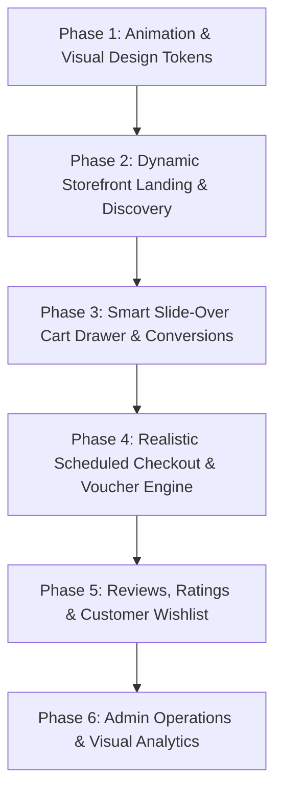

# Kế Hoạch Triển Khai Nâng Cấp Toàn Diện: Cửa Hàng Trực Tuyến & POS Chuyên Nghiệp Thực Tế

> **Quy chuẩn kỹ thuật:** Thực hiện theo TDD (Test-Driven Development), Next.js 16 App Router, React 19, Tailwind CSS 4, Prisma 6 SQLite, Zod 4. Mỗi nhiệm vụ đi kèm unit test, tuân thủ strict typing và commit riêng biệt theo chuẩn Conventional Commits.

---

## 1. Mục tiêu và Tầm nhìn

Chuyển đổi hệ thống bán hàng từ trạng thái MVP sơ khởi thành **nền tảng bán hàng đa kênh (Omnichannel POS & Storefront) hoàn chỉnh, hoạt động thực tế 100%**:

1. **Trải nghiệm thị giác & Animation mượt mà (UI/UX Wow-factor):** Tạm biệt cảm giác đơ cứng, giật cục; bổ sung hệ thống micro-interactions, hiệu ứng trượt, lướt, hover phản hồi xúc giác, skeleton loading dạng shimmer.
2. **Logic kinh doanh thực tế (E-commerce Realism):** Bổ sung đầy đủ các tính năng mà mọi cửa hàng thực tế cần: Flash Sale đếm ngược, Carousel Banner, Giỏ hàng slide-over thông minh kèm thanh Free Shipping, Hẹn giờ giao hàng, Ghi chú đơn, Mã giảm giá (Voucher), Đánh giá & Xếp hạng (Reviews), Wishlist yêu thích.
3. **Quản trị vận hành đắc lực (Admin Business Intelligence):** Cảnh báo kho an toàn, Quản lý Voucher, Biểu đồ doanh thu phân tích trực quan và In hóa đơn chuẩn in nhiệt K80.

---

## 2. Lộ trình Phân rã 6 Giai đoạn (Phases & Tasks)

---

### GIAI ĐOẠN 1: Nền tảng Animation Mượt mà & Hệ Thống Visual Tokens

#### Task 1.1: Bổ sung Micro-Animations và Keyframe Utilities trong `globals.css`

- **Mục tiêu:** Cung cấp bộ hiệu ứng chuyển động tự nhiên, không gây giật lag và hỗ trợ đầy đủ `prefers-reduced-motion`.
- **Nội dung kỹ thuật:**
  - Định nghĩa `@keyframes shimmer` cho hiệu ứng tải nội dung lấp lánh (Shimmer Skeleton).
  - `@keyframes slide-in-right`, `@keyframes slide-out-right` cho Drawers.
  - `@keyframes scale-in` cho Modal và Quick View.
  - `@keyframes pulse-subtle`, `@keyframes badge-bounce` cho icon Giỏ hàng và nhãn thông báo.
  - Các tiện ích CSS: `.card-interactive` (hover nâng nhẹ `-4px`, bóng đổ sâu mịn), `.btn-press` (`active:scale-[0.98]`).
- **File tác động:**
  - Modify: `src/app/globals.css`
  - Create: `tests/config/animation-tokens.test.ts`
- **Cam kết:** Không cài thêm thư viện animation nặng; tối ưu 60fps bằng GPU-accelerated CSS transforms.

#### Task 1.2: Bộ Thẻ Tải Dữ Liệu Shimmer Skeletons

- **Mục tiêu:** Khi dữ liệu đang tải hoặc người dùng lọc/chuyển trang, giao diện hiển thị các skeleton dạng sóng mượt mà thay vì màn hình trống hoặc xoay vòng tròn nhàm chán.
- **File tác động:**
  - Create: `src/components/kit/skeleton-loader.tsx` (Bao gồm `ProductCardSkeleton`, `CategorySkeleton`, `TableSkeleton`)
  - Test: `tests/components/kit/skeleton-loader.test.tsx`

---

### GIAI ĐOẠN 2: Trang Chủ Cửa Hàng Sinh Động & Khám Phá Sản Phẩm

#### Task 2.1: Hero Banner Carousel Tự Động Chuyển Cảnh

- **Mục tiêu:** Thay thế đoạn text tĩnh đơn điệu bằng Slider Banner quảng bá chuyên nghiệp:
  - Tự động chuyển slide mượt mà sau 5 giây, tạm dừng khi di chuột (`pause-on-hover`).
  - Nút điều hướng Slide trước/sau, chấm tròn chỉ mục (dots indicators).
  - Hỗ trợ vuốt chạm (touch swipe) trên điện thoại.
  - Nút bấm Call-To-Action nổi bật dẫn tới khuyến mãi tương ứng.
- **File tác động:**
  - Modify/Create: `src/features/online-store/landing/hero-carousel.tsx`
  - Modify: `src/features/online-store/landing/hero-section.tsx`
  - Test: `tests/components/online-store/hero-carousel.test.tsx`

#### Task 2.2: Section "Giờ Vàng Flash Sale" kèm Đồng Hồ Đếm Ngược

- **Mục tiêu:** Kích thích mua sắm với giao diện Flash Sale thời gian thực:
  - Đồng hồ đếm ngược sống động (Giờ : Phút : Giây) cập nhật từng giây.
  - Huy hiệu giảm giá bắt mắt (`-20%`, `-35%`, icon ngọn lửa 🔥).
  - Thanh tiến độ bán hàng trực quan: `"Đã bán 85%"` với dải màu tiến độ đỏ-cam.
- **File tác động:**
  - Create: `src/features/online-store/landing/flash-sale-section.tsx`
  - Create: `src/components/kit/countdown-timer.tsx`
  - Test: `tests/components/online-store/flash-sale.test.tsx`

#### Task 2.3: Quick View Modal (Xem Nhanh Sản Phẩm Tại Chỗ)

- **Mục tiêu:** Khách bấm "Xem nhanh" trên thẻ sản phẩm để mở popup xem chi tiết mà không cần load trang mới:
  - Modal hiển thị ảnh phóng to, badge tồn kho, chọn số lượng, mô tả tóm tắt.
  - Nút "Thêm vào giỏ" với hiệu ứng xác nhận tức thời.
- **File tác động:**
  - Create: `src/features/online-store/quick-view-modal.tsx`
  - Modify: `src/components/kit/product-tile.tsx`
  - Test: `tests/components/online-store/quick-view-modal.test.tsx`

#### Task 2.4: Section "Sản Phẩm Vừa Xem" (Recently Viewed)

- **Mục tiêu:** Tự động lưu ID sản phẩm khách đã xem vào `localStorage` và hiển thị thanh trượt sản phẩm vừa xem ở chân trang.
- **File tác động:**
  - Create: `src/features/online-store/recently-viewed.tsx`
  - Modify: `src/app/shop/products/[id]/page.tsx`
  - Test: `tests/features/online-store/recently-viewed.test.ts`

---

### GIAI ĐOẠN 3: Giỏ Hàng Thông Minh (Slide-Over Cart Drawer) & Tối Ưu Chuyển Đổi

#### Task 3.1: Nâng Cấp Cart Drawer Trượt Mượt & Thanh Tiến Độ Miễn Phí Vận Chuyển

- **Mục tiêu:**
  - Hiệu ứng trượt từ phải sang êm ái với phông nền mờ (`backdrop-blur-sm`).
  - **Free Shipping Progress Bar:**
    - Ví dụ: Cửa hàng miễn phí giao hàng cho đơn từ 200.000đ.
    - Nếu giỏ có 120.000đ: Hiển thị thanh tiến độ 60% kèm thông điệp: _"Mua thêm 80.000đ nữa để được FREESHIP"_.
    - Khi đạt 200.000đ: Đổi sang màu xanh lá chúc mừng: _"🎉 Bạn đã được Miễn phí giao hàng!"_.
  - Bộ nút tăng giảm số lượng (+ / -) phản hồi nhạy, nút xóa với hộp thoại xác nhận an toàn.
- **File tác động:**
  - Modify: `src/features/online-store/cart-drawer.tsx`
  - Modify: `src/features/online-store/cart-context.tsx`
  - Test: `tests/components/online-store/cart-drawer.test.tsx`

#### Task 3.2: Hiệu Ứng Cart Badge Bounce Khi Thêm Sản Phẩm

- **Mục tiêu:** Khi khách ấn "Thêm vào giỏ", icon giỏ hàng trên thanh tiêu đề nảy nhẹ và số lượng nhảy số mượt mà, kèm Toast thông báo nhỏ gọn có hình ảnh sản phẩm.
- **File tác động:**
  - Modify: `src/features/online-store/store-header.tsx`
  - Modify: `src/features/online-store/cart-feedback.tsx`
  - Test: `tests/components/online-store/cart-header-feedback.test.tsx`

---

### GIAI ĐOẠN 4: Trải Nghiệm Đặt Hàng Thực Tế & Động Cơ Khuyến Mãi (Checkout & Vouchers)

#### Task 4.1: Hệ Thống Mã Khuyến Mãi (Voucher Engine)

- **Mục tiêu:**
  - Khách hàng có thể nhập mã voucher (ví dụ: `CHAOBAN`, `FREESHIP`, `GIAM20K`) tại Cart Drawer hoặc trang Checkout.
  - Server xác thực tính hợp lệ: hạn sử dụng, số tiền đơn hàng tối thiểu, số lượng mã còn lại.
  - Trừ trực tiếp tiền giảm giá vào tổng hóa đơn một cách minh bạch.
- **File tác động:**
  - Modify: `prisma/schema.prisma` (Mở rộng hoặc tích hợp Model Voucher)
  - Create: `src/server/vouchers/validate-voucher.ts`
  - Modify: `src/server/orders/create-online-order.ts`
  - Test: `tests/server/vouchers/validate-voucher.test.ts`

#### Task 4.2: Chọn Khung Giờ Giao Hàng & Ghi Chú Đơn Hàng Cho Shipper

- **Mục tiêu:** Bổ sung các trường thiết yếu cho dịch vụ giao hàng thực tế:
  - Tùy chọn thời gian:
    - _Giao siêu tốc (trong 2 giờ)_
    - _Hẹn giờ giao:_ Chọn ngày (Hôm nay / Ngày mai) và Khung giờ (08:00 - 11:30 | 13:30 - 17:00 | 18:00 - 20:30).
  - Ô "Ghi chú đơn hàng cho tài xế/cửa hàng" (Ví dụ: "Gọi trước khi đến 10 phút, gửi bảo vệ nếu vắng nhà").
- **File tác động:**
  - Modify: `src/types/online-order.ts`
  - Modify: `src/features/online-store/checkout-form.tsx`
  - Modify: `src/server/orders/create-online-order.ts`
  - Test: `tests/components/online-store/checkout-scheduled.test.tsx`

#### Task 4.3: Thanh Tóm Tắt Đơn Hàng Cố Định (Sticky Order Summary)

- **Mục tiêu:** Cột tóm tắt thanh toán bên phải trang checkout trượt theo khi cuộn màn hình, hiển thị phân tích rõ ràng: Tạm tính, Phí ship, Giảm giá voucher, Tổng thanh toán.
- **File tác động:**
  - Modify: `src/features/online-store/checkout-form.tsx`

---

### GIAI ĐOẠN 5: Đánh Giá Xếp Hạng & Danh Sách Yêu Thích (Social Proof & Wishlist)

#### Task 5.1: Hệ Thống Xếp Hạng Sao (Star Rating) & Đánh Giá Sản Phẩm

- **Mục tiêu:**
  - Hiển thị số sao trung bình (⭐⭐⭐⭐⭐) và số lượt đánh giá trên từng thẻ sản phẩm.
  - Tab Đánh giá trong trang chi tiết sản phẩm (`/shop/products/[id]`):
    - Thống kê tỷ lệ hài lòng (ví dụ: 98% đánh giá 5 sao).
    - Danh sách nhận xét của khách hàng có huy hiệu "Đã mua hàng".
    - Biểu mẫu gửi đánh giá nhanh (chọn số sao + nhận xét).
- **File tác động:**
  - Create: `src/components/kit/star-rating.tsx`
  - Create: `src/features/online-store/product-reviews.tsx`
  - Test: `tests/components/kit/star-rating.test.tsx`

#### Task 5.2: Danh Sách Sản Phẩm Yêu Thích (Customer Wishlist)

- **Mục tiêu:**
  - Nút biểu tượng Trái Tim ❤️ ở góc thẻ sản phẩm.
  - Bấm tim để lưu sản phẩm yêu thích (lưu tức thì vào storage/account với hiệu ứng nảy tim).
  - Xem danh sách yêu thích nhanh qua Menu header.
- **File tác động:**
  - Create: `src/stores/wishlist-store.ts`
  - Create: `src/features/online-store/wishlist-drawer.tsx`
  - Modify: `src/components/kit/product-tile.tsx`
  - Test: `tests/stores/wishlist-store.test.ts`

---

### GIAI ĐOẠN 6: Quản Trị Kinh Doanh Thực Tế & Phân Tích Dữ Liệu (Admin Operations)

#### Task 6.1: Trang Quản Lý Mã Khuyến Mãi (Vouchers Management) Trong Admin

- **Mục tiêu:** Admin toàn quyền tạo, sửa, kích hoạt/tạm dừng mã giảm giá:
  - Nhập mã code, loại giảm (% hoặc số tiền VND), mức giảm, đơn tối thiểu, số lượt tối đa, hạn dùng.
  - Bảng danh sách trực quan với trạng thái Đang chạy / Hết hạn / Hết lượt.
- **File tác động:**
  - Create: `src/app/admin/promotions/vouchers/page.tsx`
  - Create: `src/server/vouchers/admin-vouchers.ts`
  - Test: `tests/server/vouchers/admin-vouchers.test.ts`

#### Task 6.2: Cảnh Báo Hàng Sắp Hết (Low-Stock Inventory Alerts)

- **Mục tiêu:** Giúp chủ cửa hàng không bao giờ bị đứt hàng:
  - Hiển thị thẻ cảnh báo và bộ lọc "Sắp hết hàng" (< 5 đơn vị) trong trang Quản lý Sản phẩm (`/admin/products`).
  - Badge đếm số mặt hàng báo động ngay trên menu Admin.
  - Thao tác 1-click nhập thêm số lượng kho nhanh tại chỗ.
- **File tác động:**
  - Modify: `src/app/admin/products/page.tsx`
  - Modify: `src/features/admin-products/`
  - Test: `tests/server/products/low-stock-alert.test.ts`

#### Task 6.3: Biểu Đồ Thống Kê Doanh Thu & Bán Chạy Trực Quan (Analytics Dashboard)

- **Mục tiêu:** Cung cấp biểu đồ trực quan hóa doanh thu cho chủ cửa hàng trong `/admin/reports`:
  - Biểu đồ doanh thu 7 ngày / 30 ngày (sử dụng SVG thuần mượt mà, tối ưu, load tức thì).
  - Tỷ trọng đơn hàng: POS tại quầy vs Đặt online.
  - Top 5 sản phẩm bán chạy nhất.
- **File tác động:**
  - Create: `src/components/kit/chart-svg.tsx`
  - Modify: `src/app/admin/reports/page.tsx`
  - Test: `tests/components/kit/chart-svg.test.tsx`

#### Task 6.4: In Hóa Đơn Bán Lẻ K80 & Phiếu Giao Hàng Chuẩn POS

- **Mục tiêu:**
  - Nút "In hóa đơn K80" trên trang chi tiết đơn hàng admin và POS.
  - Bản in thiết kế đúng chuẩn máy in nhiệt 80mm: Logo/Tên shop, SĐT, Địa chỉ, Bảng mặt hàng, Phí ship, Mã QR thanh toán VietQR, Mã vạch đơn hàng.
- **File tác động:**
  - Create: `src/features/orders/receipt-k80.tsx`
  - Modify: `src/app/admin/orders/[id]/page.tsx`
  - Test: `tests/features/orders/receipt-k80.test.tsx`

---

## 3. Kế Hoạch Xác Minh & Kiểm Thử Chất Lượng (Quality Gate)

- **Kiểm thử tự động:**
  - Chạy `pnpm check`: Linting + Typecheck + Toàn bộ Unit & Component tests.
  - Đảm bảo 100% test files pass, không có hồi quy (regression).
- **Kiểm thử Production Build:**
  - Chạy `pnpm build`: Xác thực Next.js App Router biên dịch thành công mọi routes tĩnh và động.
- **Cam kết Commit & Git:**
  - Mỗi Task sau khi hoàn thành và vượt qua kiểm thử sẽ được commit riêng biệt bằng Conventional Commits.
  - Sau khi hoàn thành toàn bộ, push code trực tiếp lên nhánh `feat/pos-core`.
